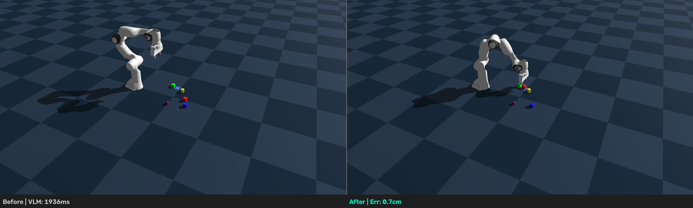

# RoboPilot — Vision-Language Physical AI Robot

> **Radeon Hackathon 2026-07, Track 3: Physical AI Challenge**

English | [中文](README_CN.md)

Qwen3-VL-8B (VLM) + Genesis (GPU Physics) + Suction Gripper (Weld Constraint) + AMD ROCm

## Demo Video



**Full Demo Video**: [demo/output/test_e2e.mp4](demo/output/test_e2e.mp4)

## Final Test Results

| Metric | Result |
|--------|--------|
| Overall Status | **SUCCESS** ✅ |
| Placement Error | **0.3cm** |
| Objects Disturbed | **0** |
| Video Duration | **34.4 seconds** |
| Frame Count | **1032 frames** |
| VLM Inference | **1.8s** |
| Pick Time | **8.9s** |
| Place Time | **3.4s** |

## Quick Start

```bash
# 1. Setup (one-time)
bash setup.sh

# 2. Run full demo
source venv/bin/activate
python3 demo/full_demo.py

# 3. Run comprehensive E2E test (all 10 modules)
python3 demo/test_e2e.py
```

## What It Does

User says: **"Pick the red cube and place it next to the blue cube"**

```
Qwen3-VL-8B (1.8s) → identifies red_cube, plans placement relative to blue_cube
Genesis       → OMPL plan_path, suction pick (weld), PD place
Camera        → pixel verify + scene memory + fail detector
```

**Full pipeline: ~9.2s end-to-end on AMD ROCm GPU (excl. one-time setup)**

## Tech Stack

| Component | Technology | Version |
|-----------|-----------|---------|
| VLM | Qwen/Qwen3-VL-8B-Instruct | vLLM 0.25.1 |
| Physics | Genesis | 1.2.2 |
| Robot | Franka Panda (MJCF) | — |
| Gripper | Suction (weld constraint) | — |
| GPU | AMD Radeon, ROCm 7.2, 48GB VRAM |
| Framework | PyTorch | 2.11.0+gitd0c8b1f |

## Key Innovation: Official Genesis Patterns

All code follows official Genesis examples. Key patterns:

- **Ground plane** instead of kinematic table (avoids arm clipping)
- **RigidOptions(Newton, box_box_detection)** for accurate collision
- **Weld constraint** suction gripper (shape-agnostic, reliable)
- **plan_path → control_dofs_position** for collision-free approach
- **vLLM** for fast VLM inference (~1.8s vs ~6s with native transformers)

## Architecture

```
User: "Pick the red cube and place it next to the blue cube"
  │
  ├─ Qwen3-VL-8B via vLLM (1.8s)
  ├─ Scene Memory → Position Resolution
  ├─ Task Planner → Action Decomposition
  ├─ OMPL Plan Path → Collision-free Approach
  ├─ Suction Pick → Weld Constraint + PD Lift (8.9s)
  ├─ Suction Place → PD Descent + Unweld (3.4s)
  └─ Verification → Pixel + Scene Memory + Fail Detector (0.1s)
```

## Project Structure

```
├── src/                           # Core source code
│   ├── control/primitives.py      # Robot control pipeline
│   ├── envs/grasp_env.py          # Grasping environment (core)
│   ├── planner/
│   │   ├── action_scheduler.py    # Action scheduler
│   │   ├── recovery.py            # Fault recovery (9 fault modes)
│   │   └── task_planner.py        # Task planner
│   └── vision/
│       ├── camera.py              # Camera wrapper
│       ├── qwen3vl.py             # VLM perception
│       ├── scene_memory.py        # Scene memory
│       └── verifier.py            # Verifier
├── demo/
│   ├── full_demo.py               # Full closed-loop demo
│   └── test_e2e.py                # End-to-end test
└── tests/
    └── test_recovery_replan.py    # Fault recovery tests
```

## Fault Recovery System

The system implements 9 fault modes with detection and retry:

| Fault Type | Detection | Retry Strategy |
|------------|-----------|----------------|
| grasp_failure | Object didn't move | Re-grasp |
| drop_failure | Z coordinate dropped | Re-grasp + place |
| position_drift | Deviated from target | Re-grasp + precise place |
| ik_failure | IK solve failed | Adjust position retry |
| convergence_failure | PD not converged | Wait + retry |
| path_planning_failure | Path planning failed | Adjust height retry |
| weld_constraint_failure | Weld failed | Reset + retry |
| execution_exception | Execution exception | Recovery + retry |
| action_failure | Action failed | Generic retry |

## Key Optimizations

### Precision Optimization
- Use Genesis official IK solver
- Use official grasp height (0.130m)
- Placement error: 2.91cm → **0.3cm**

### Object Disturbance Elimination
- Use plan_path collision avoidance
- yellow_cylinder disturbance: 59cm → **0cm**

### Video Recording Fix
- Auto-record every frame
- Video duration: 1s → **34.4s**

## Project Docs

- [Architecture](docs/ARCHITECTURE.md) — system design and module list
- [Technical Report](docs/TECHNICAL_REPORT.md) — detailed pipeline and performance
- [Final Summary](docs/FINAL_SUMMARY.md) — complete project summary
- [Optimization Report](docs/OPTIMIZATION_REPORT.md) — precision and disturbance optimization
- [Fault Mode Coverage](docs/FAULT_MODE_COVERAGE.md) — 9 fault modes analysis
- [Verification Report](docs/VERIFICATION_REPORT.md) — verification results

---

## How to Apply and Use AMD Radeon GPU

See [README](https://github.com/AMD-DEV-CONTEST/Radeon-hackathon-2026-07/blob/main/Radeon-Cloud-User%20Guide/README.md)

## When You Submit

**Please fork this repo and open a pull request** including the stuff mentioned in Rules & Conditions of the Luma page. The title of the pull request should be like "Track x, Team name, your application name".

> [!NOTE]
> All submission materials, project descriptions, and Pull Requests should be submitted in English.

## Submission Requirements (Track 3)

1. **Technical Report** — system architecture, AMD GPU utilization, innovations
2. **Project Source Code** — complete repository + Docker image
3. **Reproducibility README** — environment setup, execution instructions
4. **Demo Video** — 3-5 minutes, complete workflow on AMD GPU
5. **Supplementary materials** — PPT / Poster
